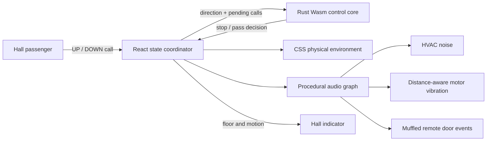

# Architecture

This repository intentionally treats a one-button waiting experience like safety-adjacent building infrastructure.

## Runtime boundaries

| Boundary | Responsibility | Failure behavior |
| --- | --- | --- |
| React coordinator | Long-running car loop, hall calls, doors and warnings | Page remains visually stable |
| Rust/Wasm core | Pure collective-control stop decision | Equivalent JavaScript fallback |
| Web Audio graph | Procedural ambience and spatial events | Simulation remains fully usable when muted |
| CSS environment | Physical materials, lighting and responsive composition | Reduced-motion preference shortens doors |

## Control invariants

1. An upward-moving car serves only an upward hall call.
2. A downward-moving car serves only a downward hall call.
3. Opposite-direction calls remain latched after the car passes.
4. Two simultaneous calls are independent and are cleared independently.
5. Audio availability never changes dispatch behavior.
6. The compiled Wasm control core must remain below 4 KiB.

## Verification strategy

The Rust unit tests verify source semantics. The Node contract test loads the exact committed Wasm artifact, checks every row in the decision table, validates its exported ABI and enforces the binary-size budget. CI then rebuilds the artifact and rejects a non-reproducible binary.
